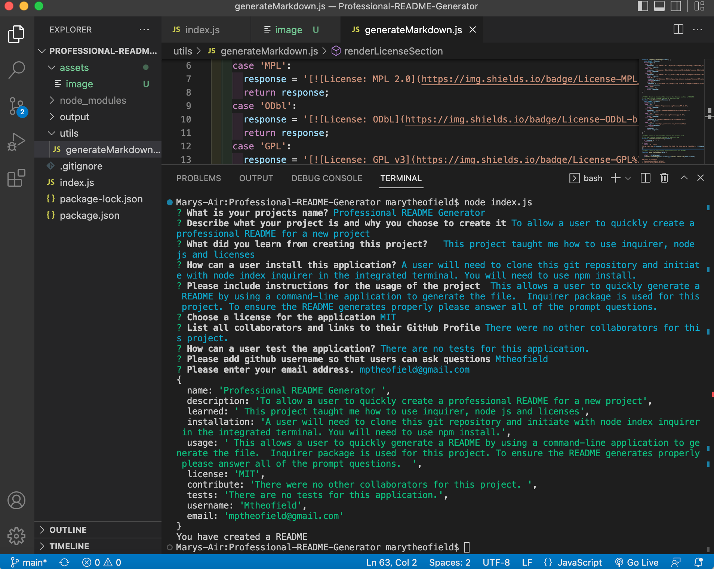
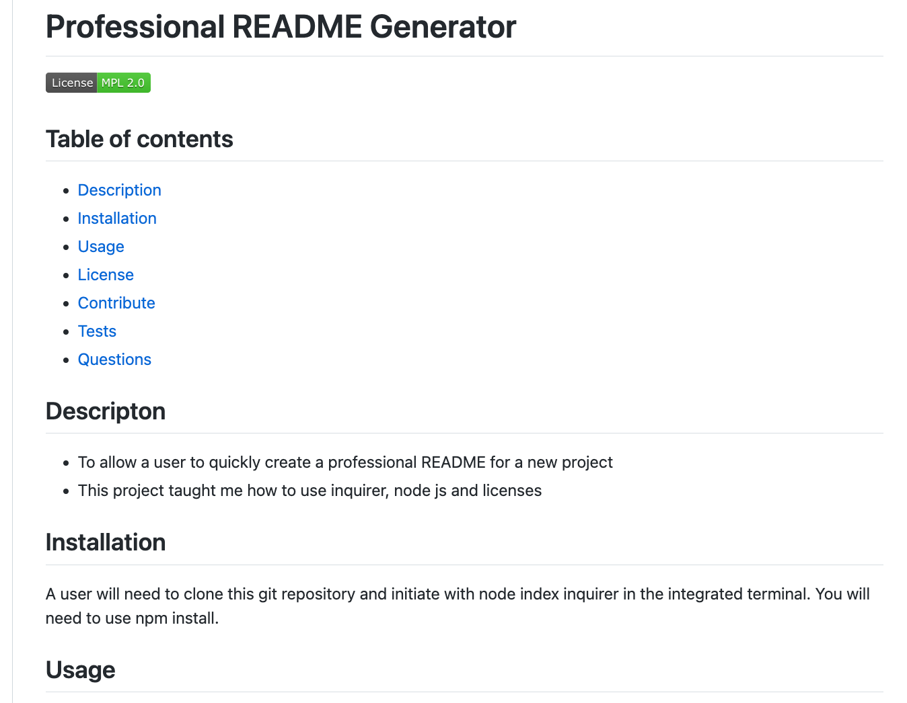

# Professional README Generator 
  

## Table of contents
- [Description](#description)
- [Installation](#installation)
- [Usage](#usage)
- [License](#license)
- [Contribute](#contribute)
- [Tests](#tests)
- [Questions](#questions)

## Descripton
  - To allow a user to quickly create a professional README for a new project
  -  This project taught me how to use inquirer, node js and licenses
  
## Installation
  A user will need to clone this git repository and initiate with node index inquirer in the integrated terminal. You will need to use npm install.

## Usage 
   This allows a user to quickly generate a README by using a command-line application to generate the file.  Inquirer package is used for this project. To ensure the README generates properly please answer all of the prompt questions. 

   Example of the integrated terminal
   

  Example of completed README
   
    A demo for this can be found here (https://drive.google.com/file/d/1aq6SQUe2NKGSUqBB5wN4S-a7erWA6ZG7/view)
  ## License
The project has MPL license. The link for this can be found here: [MPL](https://opensource.org/licenses/MPL-2.0)

## Contribute 
  There were no other collaborators for this project. 
  
## Tests
  There are no tests for this application.

## Questions

  If there are any questions about this project project, contact me at
  [$GitHub: [Mtheofield](https://github.com/Mtheofield)
  Email: [mptheofield@gmail.com](mailto:mptheofield@gmail.com)
  